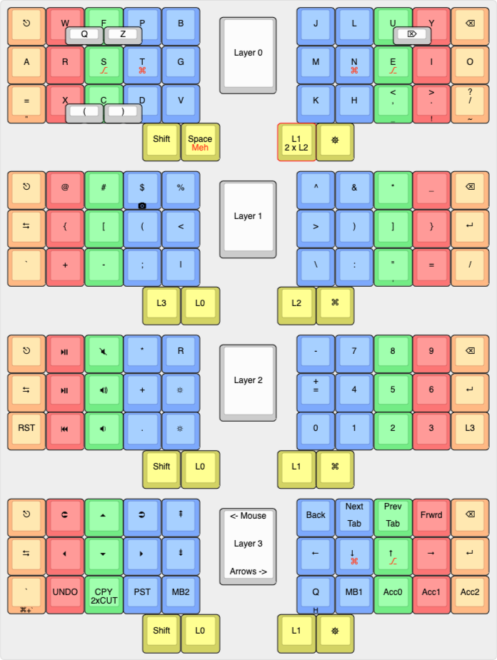

# QMK Keymap for my Ferris Sweep

## Keyboard Layout Editor

> [Link](
http://www.keyboard-layout-editor.com/#/gists/e199e464669c96167b54b0714adce2cc)

### Notes
* Overlapping half-height keys are combos
* Front labels are tap-dance holds
* Home row mods in red (also holds)

## Key combo generator
> [Link](https://codepen.io/mvaneijgen/full/LYEVQXp)